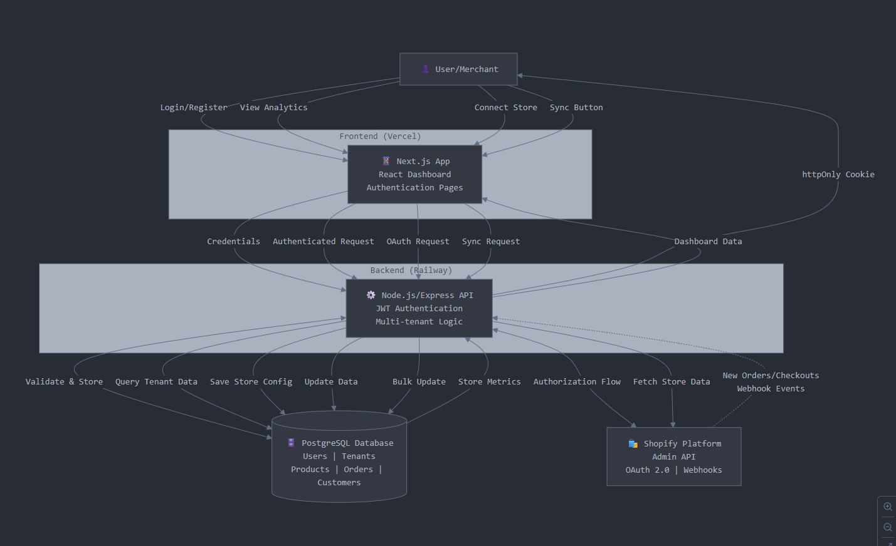

# Shopalytics: A Multi-Tenant Shopify Insights Dashboard

Shopalytics is a complete, production-ready, full-stack multi-tenant Shopify data ingestion and insights platform. This project demonstrates enterprise-level architecture for onboarding multiple Shopify stores, syncing their core business data, and visualizing key performance indicators in a secure, professional web application.

**Project Status:** ✅ **COMPLETED** - Production Ready  
**Last Updated:** January 2025

---

### ✨ Key Features

- **🔐 Secure Multi-Tenant Onboarding:** Seamlessly connect any Shopify store using the official OAuth 2.0 flow with complete tenant isolation
- **📊 Automated Data Ingestion:** Syncs core e-commerce data including Products, Customers, Orders, Line Items, and Abandoned Checkouts
- **⚡ Real-time Sync via Webhooks:** Automatically updates the database when new orders and checkouts are created in Shopify
- **🔒 Enterprise Authentication:** Complete email/password authentication system using JWTs stored in secure `httpOnly` cookies
- **📱 Responsive Dashboard:** Modern, mobile-first dashboard built with Next.js 15, React 19, and Tailwind CSS 4
- **🏪 Multi-Store Management:** Store switcher allows users to view isolated data and metrics for each connected store
- **📈 Advanced Analytics:** Professional charts for Daily Revenue, Customer Segmentation, Best-Selling Products, Sales by Hour, and Abandoned Checkouts
- **🛠️ Complete CRUD Operations:** Add, sync, and securely delete stores with all associated data
- **🚀 Production Ready:** Deployed on Vercel (Frontend) and Railway (Backend) with PostgreSQL database

---

### ⚙️ Tech Stack

| Category | Technology | Version |
| :----------- | :--------------------------------------------------------------------------------- | :------ |
| **Frontend** | Next.js, React, TypeScript, Tailwind CSS, Recharts, Radix UI, Lucide React | Next.js 15.5.3, React 19.1.0 |
| **Backend** | Node.js, Express.js, Prisma ORM, Shopify API | Node.js 18+, Express 4.18.2 |
| **Database** | PostgreSQL with Prisma ORM | PostgreSQL 15+ |
| **Authentication** | JWT with httpOnly cookies, bcrypt | jsonwebtoken 9.0.2 |
| **Deployment** | Vercel (Frontend), Railway (Backend), Railway (Alternative) | Production Ready |
| **Development** | TypeScript, ESLint, Nodemon, Turbopack | Full Type Safety |

---

### 🏛️ High-Level Architecture

The application is architected as a decoupled monorepo with a separate frontend and backend, which is a standard for modern, scalable web applications.



**Architecture Components:**

1. **Frontend (Next.js):** A server-side rendered application that handles all user-facing interactions, including the secure login and the interactive dashboard.
2. **Backend (Node.js/Express):** A RESTful API that manages all business logic, including the Shopify OAuth flow, user authentication, webhook validation, and secure database operations.
3. **Database (PostgreSQL):** A cloud-hosted PostgreSQL database that stores all application data, with a schema designed for multi-tenancy.
4. **Shopify:** Acts as the external data source, communicating with the backend via the Admin API for bulk syncing and Webhooks for real-time events.

**Data Flow:**
- Users interact with the Next.js frontend for authentication, store connection, and analytics viewing
- Frontend communicates with Node.js/Express backend via RESTful APIs
- Backend handles JWT authentication, multi-tenant logic, and data orchestration
- PostgreSQL database stores all application data with proper tenant isolation
- Shopify integration provides OAuth, Admin API access, and real-time webhooks

---

### 🚀 Getting Started

To run this project locally, you will need Node.js, npm, and a running PostgreSQL instance.

#### 1. Clone the Repository

```bash
git clone https://github.com/mrinank-bhowmick/Shopalytics.git
cd Shopalytics
```

#### 2. Backend Setup

```bash
# Navigate to the backend directory
cd backend

# Install dependencies
npm install

# Copy the environment example file
cp env.example .env

# Fill in your .env with the following variables:
# - DATABASE_URL: Your PostgreSQL connection string
# - SHOPIFY_API_KEY: Your Shopify app API key
# - SHOPIFY_API_SECRET: Your Shopify app secret
# - JWT_SECRET: A secure random string for JWT signing
# - HOST_URL: Your backend URL (http://localhost:3000 for local)

# Apply the database schema
npx prisma migrate dev

# Generate Prisma client
npx prisma generate

# Start the backend server
npm run dev
# Your backend will be running on http://localhost:3000
```

#### 3. Frontend Setup

```bash
# Navigate to the frontend directory from the root
cd frontend

# Install dependencies
npm install

# Copy the environment example file
cp env.local.example .env.local

# The .env.local file should contain:
NEXT_PUBLIC_API_BASE_URL="http://localhost:3000"

# Start the frontend server with Turbopack for faster development
npm run dev
# Your frontend will be running on http://localhost:3000 (Next.js default)
```

#### 4. Shopify App Configuration

To test the Shopify integration locally, you need to:

1. **Create a Shopify App** in your [Shopify Partner Dashboard](https://partners.shopify.com/)
2. **Configure App URLs:**
   - App URL: `https://your-ngrok-url.ngrok.io`
   - Allowed redirection URLs: `https://your-ngrok-url.ngrok.io/api/shopify/callback`
3. **Set up ngrok** to expose your local backend:
   ```bash
   ngrok http 3000 --host-header="localhost:3000"
   ```
4. **Update your backend `.env`** with the ngrok URL:
   ```bash
   HOST_URL="https://your-ngrok-url.ngrok.io"
   HOST="https://your-ngrok-url.ngrok.io"
   ```

---

### 📦 API Endpoints & Database Schema

#### Key API Endpoints

All protected routes (marked with 🔒) require an active session cookie.

| Method | Endpoint | Protection | Description |
| --- | --- | --- | --- |
| POST | /api/auth/register | Public | Register a new user. |
| POST | /api/auth/login | Public | Log in a user and set a session cookie. |
| POST | /api/auth/logout | Public | Log out a user and clear the session cookie. |
| POST | /api/auth/change-password | 🔒 | Change the password for a logged-in user. |
| GET | /api/shopify/install | Public | Starts the Shopify OAuth installation flow. |
| GET | /api/shopify/callback | Public | Handles the secure callback from Shopify. |
| POST | /api/tenants/link | 🔒 | Links a tenant to a logged-in user. |
| POST | /api/tenants/:tenantId/sync | 🔒 | Triggers a full data sync for a tenant. |
| GET | /api/tenants/me/data | 🔒 | Fetches all data for the logged-in user. |
| DELETE | /api/tenants/:tenantId | 🔒 | Deletes a tenant and all its data. |

---

### Database Schema (`schema.prisma`)

The schema is designed with a multi-tenant architecture, where all core data is isolated by a `tenantId`. The current schema includes support for abandoned checkouts and enhanced customer analytics.

```prisma
generator client {
  provider = "prisma-client-js"
}

datasource db {
  provider = "postgresql"
  url      = env("DATABASE_URL")
}

model Tenant {
  id          String   @id @default(cuid())
  storeUrl    String   @unique
  accessToken String
  createdAt   DateTime @default(now())
  customers   Customer[]
  products    Product[]
  orders      Order[]
  users       User[]     @relation("TenantToUser")
  lineItems   LineItem[]
  checkouts   Checkout[]
}

model Customer {
  id        BigInt   @id
  tenantId  String
  tenant    Tenant   @relation(fields: [tenantId], references: [id], onDelete: Cascade)
  firstName String?
  lastName  String?
  email     String?
  phone     String?
  createdAt DateTime
  orders    Order[]
  orderCount Int      @default(0)  // Enhanced analytics
  @@unique([id, tenantId])
}

model Product {
  id          BigInt   @id
  tenantId    String
  tenant      Tenant   @relation(fields: [tenantId], references: [id], onDelete: Cascade)
  title       String
  vendor      String?
  productType String?
  createdAt   DateTime
  imageUrl    String?
  lineItems   LineItem[]
  @@unique([id, tenantId])
}

model Order {
  id              BigInt    @id
  tenantId        String
  tenant          Tenant    @relation(fields: [tenantId], references: [id], onDelete: Cascade)
  totalPrice      Float
  currency        String
  financialStatus String?
  createdAt       DateTime
  customerId      BigInt?
  customer        Customer? @relation(fields: [customerId, tenantId], references: [id, tenantId], onDelete: Cascade)
  lineItems       LineItem[]
  checkoutId      BigInt?    @unique  // Link to abandoned checkout
  @@unique([id, tenantId])
}

model LineItem {
  id        BigInt   @id
  tenantId  String
  tenant    Tenant   @relation(fields: [tenantId], references: [id], onDelete: Cascade)
  orderId   BigInt
  order     Order    @relation(fields: [orderId, tenantId], references: [id, tenantId], onDelete: Cascade)
  productId BigInt?
  product   Product? @relation(fields: [productId, tenantId], references: [id, tenantId], onDelete: SetNull)
  quantity  Int
  price     Float
  title     String
  name       String? // Enhanced line item details
  vendor     String? // Vendor information
  @@unique([id, tenantId])
}

model User {
  id        String   @id @default(cuid())
  email     String   @unique
  password  String
  createdAt DateTime @default(now())
  tenants   Tenant[] @relation("TenantToUser")
}

model Checkout {
  id              BigInt    @id
  tenantId        String
  tenant          Tenant    @relation(fields: [tenantId], references: [id], onDelete: Cascade)
  totalPrice      Float
  currency        String
  customerEmail   String?
  webUrl          String?   // Recovery URL for abandoned carts
  createdAt       DateTime  @default(now())
  updatedAt       DateTime  @updatedAt
  @@unique([id, tenantId])
}
```

---

### 📁 Project Structure

```
Shopalytics/
├── backend/                    # Node.js/Express API server
│   ├── config/                 # Configuration files
│   │   ├── prisma.config.js    # Prisma configuration
│   │   └── shopify.config.js   # Shopify API configuration
│   ├── controllers/            # Route controllers
│   │   ├── auth.controller.js  # Authentication logic
│   │   ├── shopify.controller.js # Shopify integration
│   │   ├── tenant.controller.js # Tenant management
│   │   └── webhook.controller.js # Webhook handling
│   ├── middleware/             # Express middleware
│   │   └── auth.middleware.js  # JWT authentication
│   ├── routes/                 # API routes
│   │   ├── auth.routes.js      # Authentication endpoints
│   │   ├── shopify.routes.js   # Shopify OAuth flow
│   │   ├── tenant.routes.js    # Tenant management
│   │   └── webhook.routes.js   # Webhook endpoints
│   ├── services/               # Business logic services
│   │   └── shopify.service.js  # Shopify API service
│   ├── utils/                  # Utility functions
│   │   └── bigint.util.js      # BigInt handling utilities
│   ├── prisma/                 # Database schema and migrations
│   │   ├── schema.prisma       # Database schema
│   │   └── migrations/         # Database migration files
│   ├── server.js               # Main server file
│   ├── package.json            # Backend dependencies
│   ├── Railway.yaml             # Railway deployment config
│   └── railway.json            # Railway deployment config
├── frontend/                   # Next.js React application
│   ├── app/                    # Next.js 13+ app directory
│   │   ├── (auth)/             # Authentication pages
│   │   │   ├── login/          # Login page
│   │   │   ├── register/       # Registration page
│   │   │   └── shopify/        # Shopify return page
│   │   ├── dashboard/          # Main dashboard
│   │   │   ├── customers/      # Customer management
│   │   │   ├── orders/         # Order management
│   │   │   ├── products/       # Product management
│   │   │   ├── metrics/        # Analytics dashboard
│   │   │   └── settings/       # Store settings
│   │   ├── layout.tsx          # Root layout
│   │   └── page.tsx            # Home page
│   ├── components/             # Reusable React components
│   │   ├── ui/                 # Base UI components
│   │   ├── *.tsx               # Feature-specific components
│   │   └── charts/             # Data visualization components
│   ├── lib/                    # Utility libraries
│   │   ├── clientApiService.ts # Client-side API calls
│   │   ├── serverApiService.ts # Server-side API calls
│   │   └── utils.ts            # Utility functions
│   ├── package.json            # Frontend dependencies
│   └── next.config.ts          # Next.js configuration
└── README.md                   # Project documentation
```

---

### 🚀 Deployment

#### Production Deployment

The application is deployed using modern cloud platforms:

- **Frontend**: [shopalytics.vercel.app](https://shopalytics.vercel.app) - Live production site on Vercel
- **Backend**: [Railway](https://Railway.com/) - Containerized Node.js deployment
- **Database**: [Supabase](https://supabase.com/) - Managed PostgreSQL with real-time features
- **Alternative**: [Railway](https://railway.app/) - Full-stack deployment option

#### Environment Variables

**Backend (.env):**
```bash
DATABASE_URL="postgresql://..."
SHOPIFY_API_KEY="your_shopify_api_key"
SHOPIFY_API_SECRET="your_shopify_api_secret"
JWT_SECRET="your_jwt_secret"
HOST_URL="https://your-backend-url.com"
```

**Frontend (.env.local):**
```bash
NEXT_PUBLIC_API_BASE_URL="https://your-backend-url.com"
```

---

### 🎯 Project Completion Status

✅ **Authentication System**
- User registration and login
- JWT-based authentication with httpOnly cookies
- Password hashing with bcrypt
- Secure session management

✅ **Multi-Tenant Architecture**
- Complete tenant isolation
- Store switching functionality
- Secure data access controls

✅ **Shopify Integration**
- OAuth 2.0 flow implementation
- Real-time webhook processing
- Comprehensive data synchronization
- Abandoned checkout tracking

✅ **Data Management**
- Products, Customers, Orders, Line Items
- Automated data syncing
- Manual sync triggers
- Data deletion with cascade

✅ **Analytics Dashboard**
- Revenue analytics with date filtering
- Customer segmentation charts
- Best-selling products visualization
- Sales by hour analysis
- Abandoned checkout insights

✅ **User Interface**
- Responsive design with Tailwind CSS
- Modern component library (Radix UI)
- Interactive charts (Recharts)
- Professional loading states and error handling

✅ **Production Ready**
- TypeScript for type safety
- ESLint for code quality
- Comprehensive error handling
- Security best practices
- Scalable architecture

---

### 🤝 Contributing

This project is complete and production-ready. For any improvements or extensions:

1. Fork the repository
2. Create a feature branch (`git checkout -b feature/amazing-feature`)
3. Commit your changes (`git commit -m 'Add amazing feature'`)
4. Push to the branch (`git push origin feature/amazing-feature`)
5. Open a Pull Request

---

### 📄 License

This project is licensed under the MIT License - see the [LICENSE](LICENSE) file for details.

---

### 🙏 Acknowledgments

- [Shopify](https://shopify.dev/) for the comprehensive API and documentation
- [Next.js](https://nextjs.org/) for the amazing React framework
- [Prisma](https://prisma.io/) for the excellent ORM
- [Vercel](https://vercel.com/) and [Railway](https://Railway.com/) for hosting
- [Tailwind CSS](https://tailwindcss.com/) for the utility-first CSS framework
